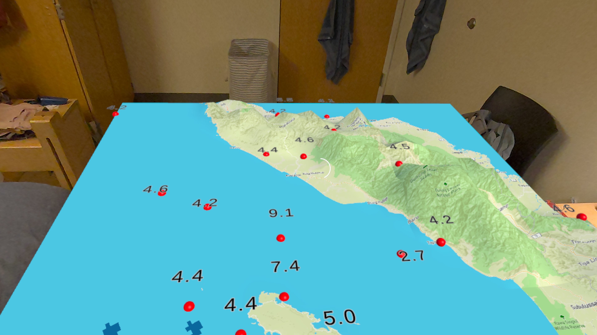
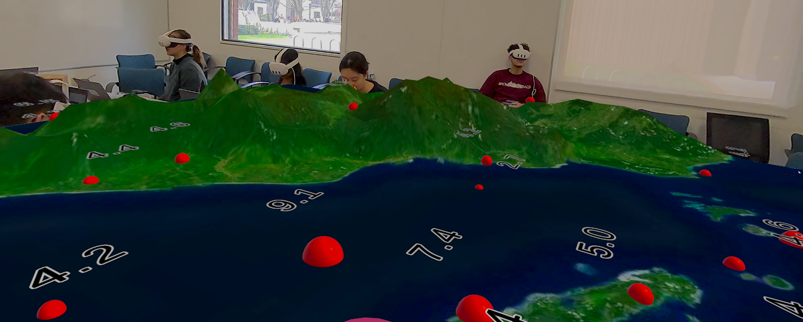
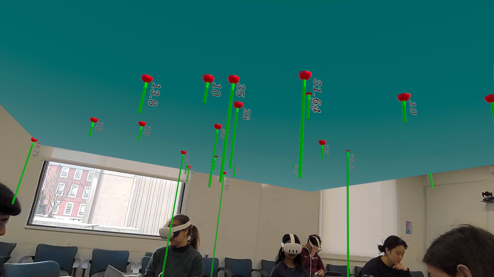

# QuakeScape: Feeling Earthquake Data in Haptic Augmented Reality

QuakeScape is an interactive augmented reality application that visualizes real earthquake data from Indonesia’s Sumatra region on a 3D map overlay. Built in Unity with Mapbox for the Meta Quest headset, the project allows users to explore 25 years of earthquake activity (2000–2025) through spatial visualization, haptic feedback, and audio.

## Demo

*3D terrain map of the Sumatra region displaying earthquake events from 2000–2025.*

 

*Close-up view showing earthquake magnitude markers and spatial positioning on the terrain model.*

 

*Underside view of the AR map showing the relative depth of earthquake epicenters beneath the terrain surface.*

## Overview

The project explores how augmented reality can make geophysical data more intuitive and engaging by moving earthquake information off the flat screen and into real space. Earthquake events are rendered as interactive markers on a terrain-based map, where users can compare seismic events through multiple visual and sensory cues.

## Features

- AR passthrough experience for Meta Quest
- 3D terrain-based visualization of earthquakes in the Sumatra region
- Earthquake markers encoded with magnitude, depth, and error-related values
- Haptic feedback linked to earthquake magnitude and waveform-inspired patterns
- Audio playback associated with earthquake events
- Interactive spatial exploration of historical seismic activity from 2000 to 2025

## Haptic Feedback

Each earthquake site in the AR map emits haptic vibrations based on real seismic data. When the user places their controller over an earthquake epicenter, the app:

- plays an audio clip associated with the quake
- triggers haptics reflecting the quake’s seismographic waveform and magnitude

The waveform data was extracted using the SAGE Wilber 3 tool and processed into `.haptic` files through a custom Python pipeline that mapped waveform amplitude to vibration strength.

## Tech Stack

- Unity
- Meta Quest
- Meta XR SDK
- Meta Haptics Studio
- Mapbox
- Python
- Git LFS

## Data Sources

- USGS Earthquake Catalog
- SAGE Wilber 3 (waveforms and audio)

## Build

The latest build, `Eearthquake Visualization Final.apk`, is included in this repository and tracked with Git LFS.

## Project Context

This project was developed as an academic XR data visualization project exploring how multisensory interaction can improve the interpretation of earthquake data in augmented reality.
